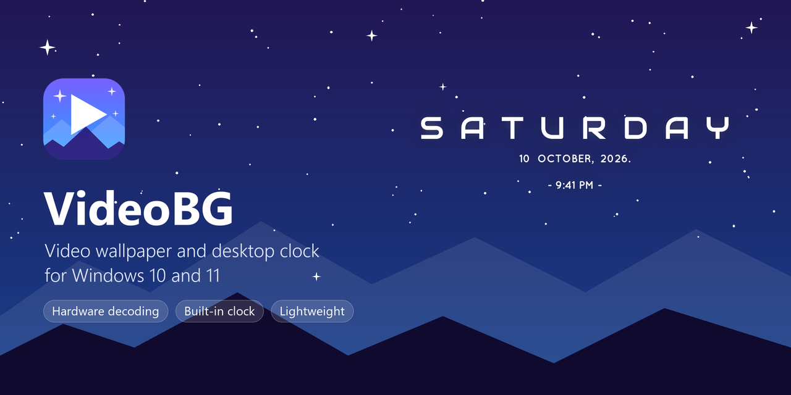

<p align="center">
  
</p>

<p align="center">
  <a href="https://github.com/Skyblock127/VideoBG/releases/latest"></a>
  <a href="https://github.com/Skyblock127/VideoBG/releases"></a>
  
  
</p>

<p align="center">
  <a href="https://github.com/Skyblock127/VideoBG/releases/latest/download/VideoBG.zip"><b>⬇ Download VideoBG.zip (latest)</b></a>
  ·
  <a href="#update-to-a-new-version">How to update</a>
</p>

VideoBG plays a video behind your desktop icons and adds a desktop clock. It's one small exe:
your graphics chip decodes the video, the wallpaper pauses when nobody can see it, and switching
it off stops the video part completely.

## Features

- **Any video Windows can play:** MP4, MOV, MKV, WebM, AVI and more. VideoBG turns animated GIFs
  into a video once and then uses that.
- **`Ctrl + Alt + B`** turns the wallpaper on and off.
- **Light on your PC:** decoding runs on the GPU, and the wallpaper pauses while apps cover the
  desktop, the PC is locked or the screen is off.
- **Video versions:** lighter copies of a video (screen size, 900p, 720p, 540p) when you want
  it to use less memory.
- **Crop:** choose which part of the video fills the screen.
- **Desktop clock:** day, date and time, which you can drag anywhere, with your own colour, size,
  opacity and glow.
- **Lock screen:** while the wallpaper is on, the lock screen shows a frame of the video.
- **Sound:** silent, the video's own sound, or your own music.
- **Clear errors:** if a video won't play, VideoBG says why and gives you the fix.

## Install

You'll need 64-bit Windows 10 or 11. VideoBG doesn't need admin rights.

1. Download **[VideoBG.zip](https://github.com/Skyblock127/VideoBG/releases/latest/download/VideoBG.zip)**.
2. Right-click the zip and choose **Extract All**. Put the **VideoBG** folder somewhere it can stay,
   for example `C:\Tools\VideoBG`. VideoBG runs from that folder.
3. Double-click **Install.cmd**. It adds VideoBG to the Start menu and your startup apps, then
   opens it.
   - If Windows says *"Windows protected your PC"*, click **More info**, then **Run anyway**. The
     warning appears only because the app isn't code-signed.
4. Click **Choose video** and pick a video.

VideoBG then lives in the tray (notification area). Click its icon to open the settings.

## Update to a new version

Already have VideoBG? You don't need to uninstall. Your settings are kept.

1. Download the new **[VideoBG.zip](https://github.com/Skyblock127/VideoBG/releases/latest/download/VideoBG.zip)**.
2. Right-click the VideoBG icon in the tray and choose **Exit**.
3. Extract the new zip into the same VideoBG folder and choose **Replace the files**.
4. Double-click **Install.cmd** again.

The version you have is shown at the bottom left of VideoBG's settings window. What changed in
each version is on the [releases page](https://github.com/Skyblock127/VideoBG/releases).

## Uninstall

Double-click **Uninstall.cmd** in the VideoBG folder. It puts your own lock screen picture back
and asks whether to delete your settings too. Then delete the folder.

## How to use

| Where | What you can do |
|---|---|
| `Ctrl + Alt + B` | Turn the wallpaper on or off. The tray menu does the same. |
| **Video** | **Choose video**, **Crop** it, and pick the lock screen frame with the **Preview** slider. **Versions** makes lighter copies. |
| **Desktop clock** | Drag the clock on the preview to place it. Choose its colour, size, opacity, glow and 12/24-hour time. Set it up separately for the video wallpaper and your still wallpaper, and give a video its own clock with **This video**. **Show clock / Hide clock** turns it on or off for each. |
| **Sound** | Nothing (the default), the video's sound, or your own songs. |
| **Playback** | Fill / Fit / Stretch, speed, a frame-rate cap, and which displays to use. |
| **Power saving** | Pause when apps cover the desktop, and what to do on battery. |
| **General** | Change the hotkey, choose whether the wallpaper starts on, and find your data folders. |

To turn off starting with Windows, go to **Windows Settings > Apps > Startup**.

## If a video won't play

VideoBG shows the reason and the fix on the Video page. Usually Windows is missing a codec:

| Video | Install this, then come back to VideoBG |
|---|---|
| AV1 (common in 4K YouTube downloads) | [AV1 Video Extension](https://apps.microsoft.com/detail/9MVZQVXJBQ9V) (free) |
| VP9 (common in WebM) | [VP9 Video Extensions](https://apps.microsoft.com/detail/9N4D0MSMP0PT) (free) |
| HEVC / H.265 (phones, cameras) | [HEVC Video Extensions](https://apps.microsoft.com/detail/9NMZLZ57R3T7) (small fee) |
| MPEG-2 (DVDs, older recordings) | [MPEG-2 Video Extension](https://apps.microsoft.com/detail/9N95Q1ZZPMH4) (free) |

The wallpaper starts again by itself once the codec is installed.

## Building from source

You'll need [MinGW-w64](https://www.mingw-w64.org/) with g++ and windres on PATH.

```powershell
.\build.ps1 -Zip    # dist\VideoBG.exe and dist\VideoBG.zip
.\install.ps1       # run VideoBG from this folder: Start menu shortcut and startup entry
```

To redraw the icons and banner, you'll also need Python with Pillow. Run `tools\make_icons.py`
and `tools\make_banner.py`.

## Credits

- **Clock design:** the clock's layout, sizes and spacing come from
  [Mond](https://www.deviantart.com/apexxx-sensei/art/Mond-762455575), a Rainmeter skin by
  **ApexXx-SenSei**. VideoBG redraws that design with its own code and includes none of the skin's
  files.
- **Fonts:** [Audiowide](https://fonts.google.com/specimen/Audiowide) by Astigmatic and
  [Quicksand](https://fonts.google.com/specimen/Quicksand) by Andrew Paglinawan, both under the
  [SIL Open Font License 1.1](res/fonts/OFL.txt).
